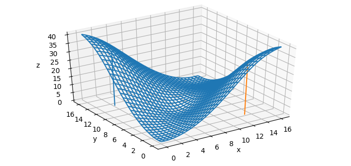
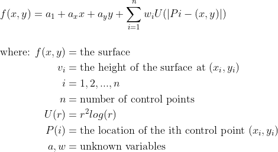
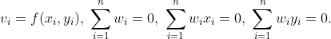
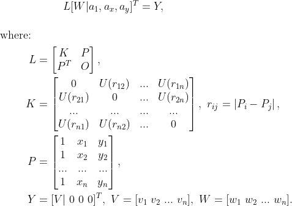
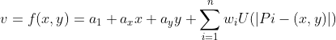

# Interactive Thin-Plate Spline Interpolation

TPS is an interpolation technique that finds a "minimally bent" smooth surface that passes through a given set of points. Here's an example of a TPS surface with 5 control points.

<p align="center"> 
  
</p>

The equation of the surface is of the form:

<p align="center"> 
  
</p>

There are two parts in the function f. The first three terms form an affine, or linear part, that represents the behavior at infinity. It is basically a flat plane that the surface approaches at infinity. The second term, which is a sum of functions U(r), provides the bending to the surface.
So the unknown coefficients a and w can be obtained by solving the linear system of equations,

<p align="center"> 
  
</p>

These equations can be arranged nicely into a matrix as:
<p align="center"> 
  
</p>

Then, once we know the values for w and a, we can interpolate v for arbitrary points (x, y) using:
<p align="center"> 
  
</p>

### Demo
<p align="center"> 
  
</p>

### Usage
```bash
$ python3 tps.py --path sample.png
```

### References
- ["Manual Registration with Thin Plates" by Herve Lombaert](https://profs.etsmtl.ca/hlombaert/thinplates/)
- Bookstein, F.L., 1989. Principal warps: Thin-plate splines and the decomposition of deformations. IEEE Transactions on pattern analysis and machine intelligence, 11(6), pp.567-585.
- [Thin Plate Splines (TPS) library](https://github.com/mdedonno1337/TPS)
